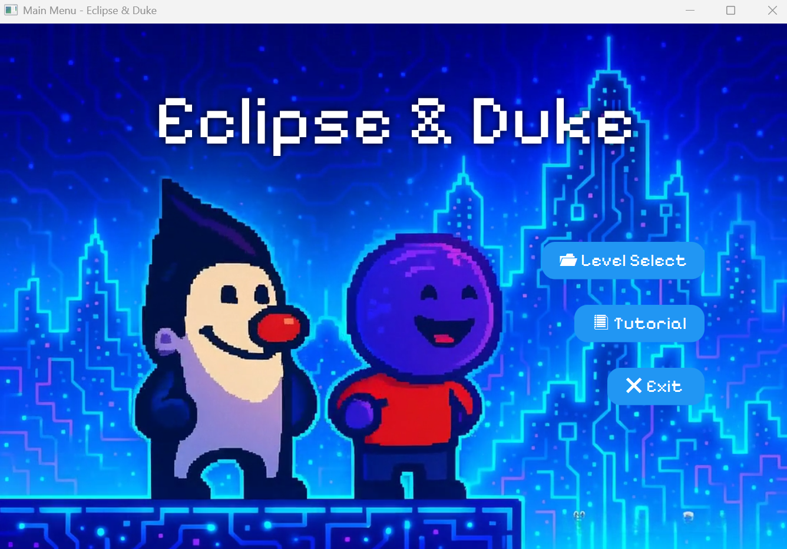
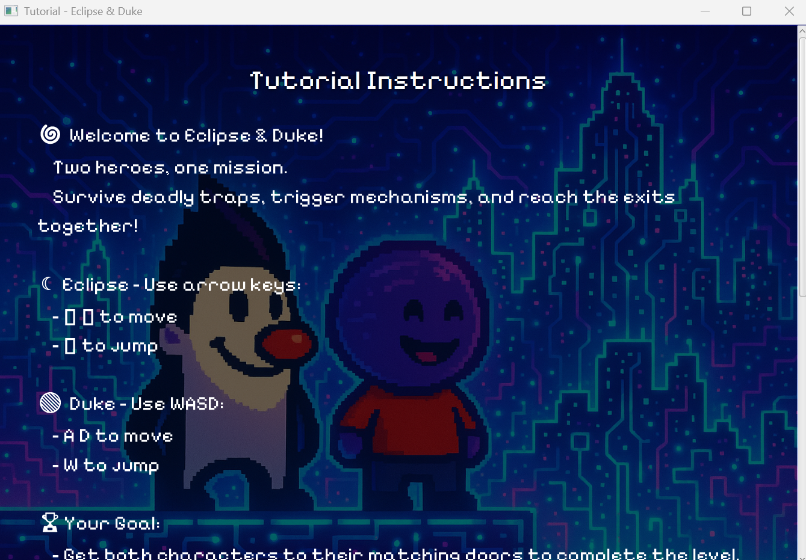
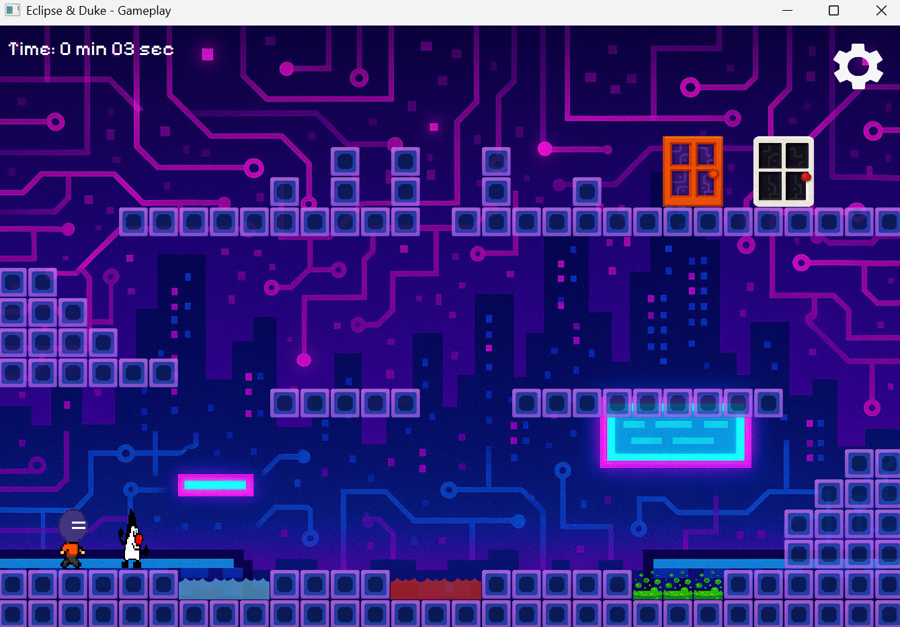
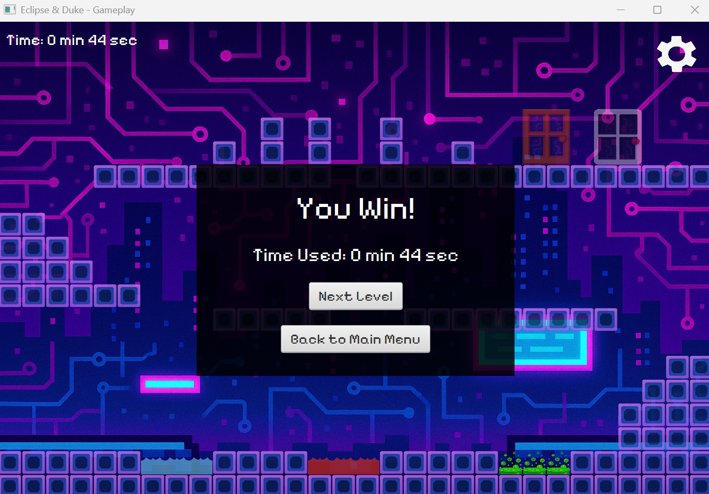

# Eclipse & Duke

A cooperative 2D puzzle-platformer inspired by *Fireboy & Watergirl*, developed using **JavaFX** as a university group project. Players control two unique characters with different abilities, working together to solve environmental puzzles, collect keys, avoid hazards, and reach the exit across three handcrafted levels.

---

## 🎮 Features

* Control two unique playable characters.

* Solve environmental puzzles to progress through each level.

* Collect keys to unlock exit doors.

* Navigate hazards including spikes, poison, and laser obstacles.

* Explore three handcrafted levels with increasing difficulty.

* Enjoy background music, sound effects, and animated game elements for an immersive experience.

---

## 🛠️ Technologies Used

* Java

* JavaFX

* Eclipse IDE

---

## 👩‍💻 My Contributions

This project was developed collaboratively by a team of three. My primary responsibilities included:

* Designing the initial project architecture and project setup.

* Designing and implementing the game maps and level layouts.

* Creating and integrating environmental objects throughout the game.

* Debugging and integrating different project components to ensure smooth gameplay.

---

## 👥 Team

Developed by:

* Jessica Diesca

* Tung Xin Yue

* Xie Wanen

---

## 🚀 How to Run

1. Clone this repository.

2. Import the project into Eclipse or another Java IDE that supports JavaFX.

3. Configure the required JavaFX libraries (if not already installed).

4. Run `Main.java` to start the game.

---

## 📸 Screenshots

### 🏠 Main Menu

The game's landing page featuring the main navigation and animated background.

---

### 📖 Tutorial Screen

An in-game tutorial introducing the controls, mechanics, and gameplay objectives.

---

### 🎮 Level 1 Gameplay

Players cooperate to solve puzzles, collect keys, and overcome environmental obstacles while controlling both Eclipse and Duke.

---

### 🏆 Victory Screen

Displayed after successfully completing the final level, celebrating the player's achievement.

---

## 📌 Future Improvements

Although this project is complete as a university assignment, several enhancements could be added in future iterations:

* Additional levels and puzzles.

* Improved enemy AI and obstacle mechanics.

* Save/load game progress.

* Additional character abilities and interactions.

* Expanded visual effects and animations.

---

## 📄 Acknowledgements

This project was developed as part of a university coursework assignment and was inspired by the cooperative gameplay mechanics of *Fireboy & Watergirl*. It was created for educational purposes to explore object-oriented programming, JavaFX application development, game design, and collaborative software development.

